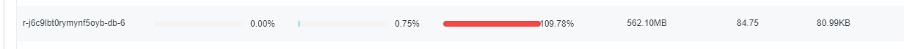
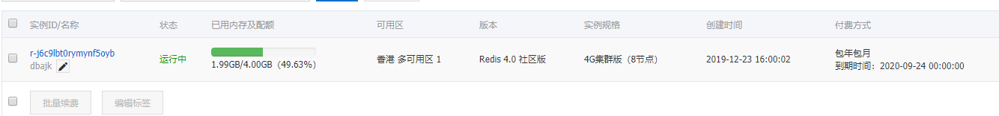
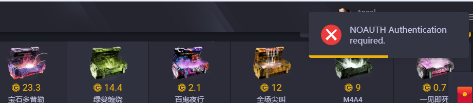
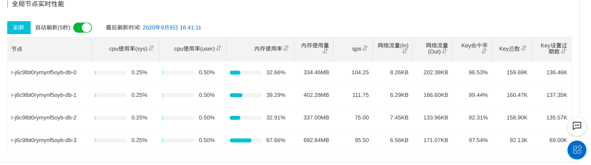
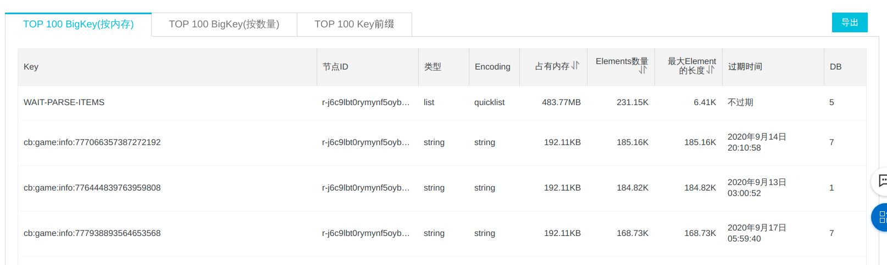
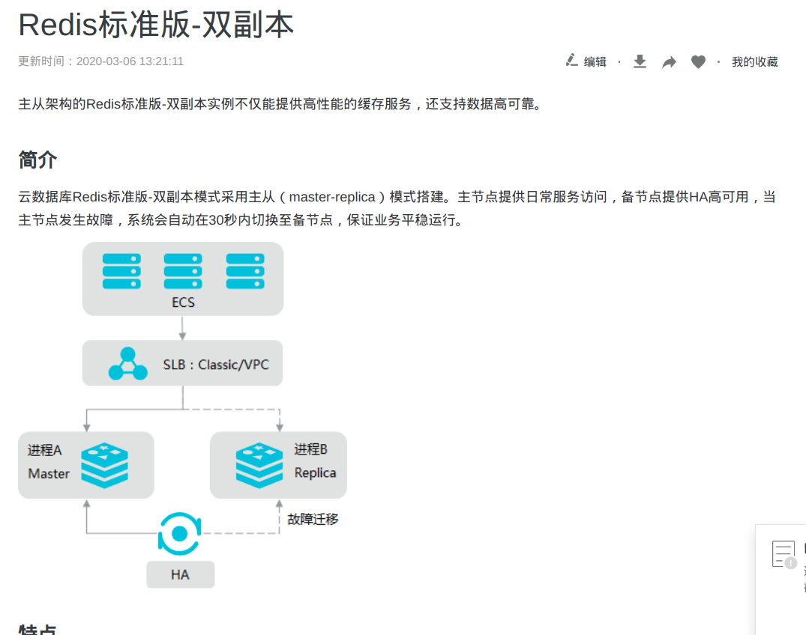

<!--
author: Jimersy Lee
head: 
date: 2020-09-16
title: 关于Redis集群倾斜问题的处理方案分享
tags: DEVOPS
images: 
category: devops
status: publish
summary: Redis是一个高性能的key-value数据库，现时越来越多企业与应用使用Redis作为缓存服务器。但是在集群使用过程中,你是否遇到过redis监控指标良好,但是使用redis总是有奇怪的问题,本文带你一探究竟!
-->

# 故障表现

网站用户无法注册,还出现很多莫名其妙的问题

## 阿里云监控情况

总共8个数据库,其中6号数据库内存超过设定的最大值

但是总内存情况并没有出现高负载的情况

## 切换Redis集群架构后出现的问题

原因:因为php-fpm运行方式选择的静态的,常驻模式,项目中配置的域名,实际在切换之后域名解析的ip变了,但是php-fpm存在dns缓存,还是连接旧的redis服务,出现此问题

解决:重启web服务器上的php-fpm

## 切换为4分片集群后的内存使用情况

虽然当时网站恢复正常,但是实际上并没有解决问题,3号数据库还可能出现内存满了,然后回收内存的情况

继续通过阿里云的监控排查问题,发现是6号数据库的内存超限是由于存在大key

此大key业务上是为了录入steam新出的饰品,但是实际上没消费或者消费很慢

解决方案:业务上其实不像C5GAME一样,需要自动采集新饰品种类,在代码上删除掉往这个key推送任务的逻辑

## 阿里云可选的Redis服务架构

### 标准版

[标准版文档](https://help.aliyun.com/document_detail/52226.html)

## 结论

1. Redis集群选型的时候,初期可以选择主从架构,而不是分片架构,主从架构不会有倾斜的情况发生;当后期达到性能瓶颈之后,切换为分片集群
2. 如果选用了分片集群,一定要加上针对每个分片的监控报警,防患于未然
3. 应用中如果使用了List,Set,Hash等集合类型,一定要监控业务消费是否正常,避免大key的产生

## 参考文章

1. [浅析 Redis 分布式集群倾斜问题](https://www.jishuwen.com/d/2E5O)
